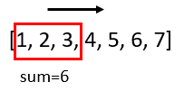

## Window Sum      
    
```
Given array: [1,2,3,4,5,6,7]
Given window: 3
Output: [6,9,12,15,18]
就想成有一个框，长度是3，沿着数组走，每走一格算一个sum出来
```     
           

###Two method     
- Use ArrayList()//                              
- Use int[arr.length-windowSize+1] result   //                    
                                             
          
###Main Code           
```
import java.util.ArrayList;

public class WindowSum {

	public static void main(String[] args) {
		// TODO Auto-generated method stub
		/*
		 * Given array: [1,2,3,4,5,6,7]
			Given window: 3
			Output: [6,9,12,15,18]
		 */
		int []arr = new int[]{1,2,3,4,5,6,7};
		int windowSize = 3;
		int [] answer = new App9().windowSum(arr, windowSize);
		for(int i = 0;i<answer.length;i++){
			System.out.print(answer[i]+"  ");
		}
		System.out.println("\nmethod 2");
		int [] answer2 = new App9().windowSum2(arr, windowSize);
		for(int i = 0;i<answer2.length;i++){
			System.out.print(answer2[i]+"  ");
		}			
	}
}

class App9{
	int[] windowSum(int[] arr, int k){
		if(arr.length<k||arr==null)
			return null;
		ArrayList<Integer> list = new ArrayList<Integer>();
		for(int i = 0; i<=arr.length-k;i++){
				int sum = 0;
				for(int j=i;j<i+k;j++){
					sum+=arr[j];
				}
				list.add(new Integer(sum));
		}
		int [] a = new int[list.size()];
		for(int i = 0;i<a.length;i++){
			a[i] = list.get(i);
		}
		return a;
	}
	
	int[] windowSum2(int[] arr, int k){
		if(arr.length<k||arr==null)
			return null;
		int [] a = new int[arr.length-k+1];
		int count = 0;
		for(int i = 0; i<=arr.length-k;i++){
				int sum = 0;
				for(int j=i;j<i+k;j++){
					sum+=arr[j];
				}
			a[count++] = sum;
		}
		
		return a;
	}
}

```
