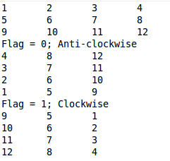

##Rotate Matrix       
     
把一个m*n的矩阵旋转90度，给一个flag规定是向左转还是向右转.        
Flag=1 ClockWise, Flag = 0 anti-clockwise               
         
            
          
###Method        
####step1. Transform the matrix       
```
int[][] tFunc(int [][]arr){
		int row = arr.length;
		int col = arr[0].length;
		int [][]arr_T = new int[col][row];
		for(int i = 0;i<row;i++){
			for(int j = 0;j<col;j++){
				arr_T[j][i] = arr[i][j];
			}
		}
		return arr_T;
	}
```              
         
####step2. Flip the matrix according to different flag value      
```
int[][] flip(int [][]arr, int flag){
		int row = arr.length;
		int col = arr[0].length;
		int [][]arr_F = new int[row][col];
		if(flag == 1){//clock wise, change column
			for(int i = 0;i<row;i++){
				for(int j = 0;j<col;j++){
					arr_F[i][col-1-j] = arr[i][j];
				}
			}
		}else{//Anti-clockwise, change row
			for(int i = 0;i<row;i++){
				for(int j = 0;j<col;j++){
					arr_F[row-1-i][j] = arr[i][j];
				}
			}
		}
		return arr_F;
	}
```           
                   
####step3. Combine them together             
```
int[][] rotateMatrix(int [][]arr, int flag){
		int[][] arr_T = tFunc(arr);
		int[][] arr_result = flip(arr_T,flag);
		
		return arr_result;
	}
```                    
            
          
###Main Code
```

public class RotateMatrix {

	public static void main(String[] args) {
		// TODO Auto-generated method stub
		int row = 3;
		int col = 4;
		int count =1;
		int[][] arr = new int[row][col];
		for(int i = 0;i<row;i++){
			for(int j = 0;j<col;j++){
				arr[i][j] = count++ ;
			}
		}
		for(int i = 0;i<row;i++){
			for(int j = 0;j<col;j++){
				System.out.print(arr[i][j]+"\t");
			}
			System.out.println("");
		}
		
		int[][] arr_rotate1 = new App1().rotateMatrix(arr, 0);
		int[][] arr_rotate2 = new App1().rotateMatrix(arr, 1);
		System.out.println("Flag = 0; Anti-clockwise");
		for(int i = 0;i<arr_rotate1.length;i++){
			for(int j = 0;j<arr_rotate1[0].length;j++){
				System.out.print(arr_rotate1[i][j]+"\t");
			}
			System.out.println("");
		}
		System.out.println("Flag = 1; Clockwise");
		for(int i = 0;i<arr_rotate2.length;i++){
			for(int j = 0;j<arr_rotate2[0].length;j++){
				System.out.print(arr_rotate2[i][j]+"\t");
			}
			System.out.println("");
		}
	}

}

class App1{
	int[][] rotateMatrix(int [][]arr, int flag){
		int[][] arr_T = tFunc(arr);
		int[][] arr_result = flip(arr_T,flag);
		
		return arr_result;
	}
	int[][] tFunc(int [][]arr){
		int row = arr.length;
		int col = arr[0].length;
		int [][]arr_T = new int[col][row];
		for(int i = 0;i<row;i++){
			for(int j = 0;j<col;j++){
				arr_T[j][i] = arr[i][j];
			}
		}
		return arr_T;
	}
	int[][] flip(int [][]arr, int flag){
		int row = arr.length;
		int col = arr[0].length;
		int [][]arr_F = new int[row][col];
		if(flag == 1){//clock wise, change column
			for(int i = 0;i<row;i++){
				for(int j = 0;j<col;j++){
					arr_F[i][col-1-j] = arr[i][j];
				}
			}
		}else{//Anti-clockwise, change row
			for(int i = 0;i<row;i++){
				for(int j = 0;j<col;j++){
					arr_F[row-1-i][j] = arr[i][j];
				}
			}
		}
		return arr_F;
	}
}

```            
         

