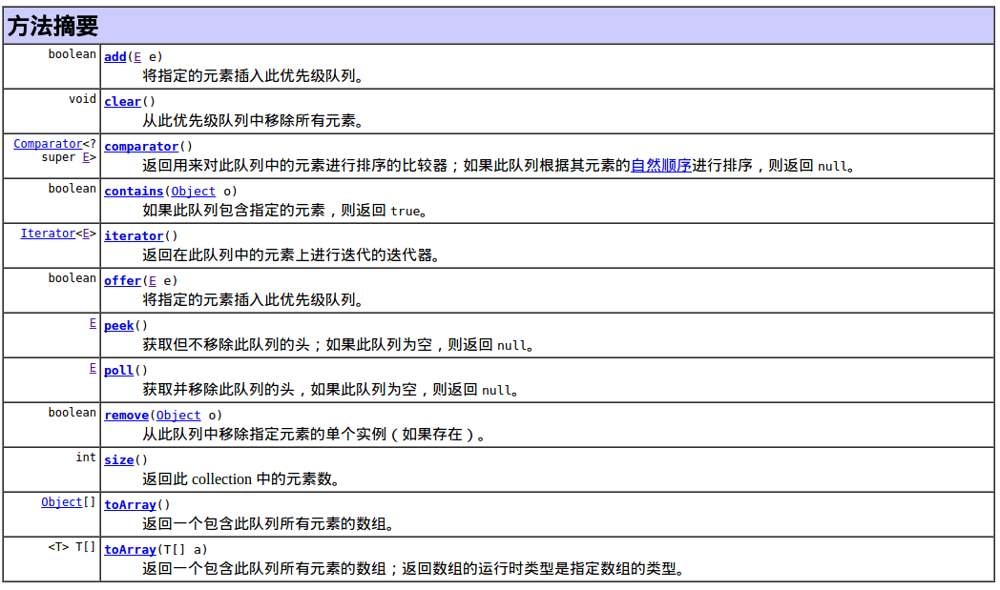

##PriorityQueue         
        
- 如果不提供Comparator的话，优先队列中元素默认按自然顺序排列，也就是数字默认是小的在队列头，字符串则按字典序排列。           
- 如果想实现按照自己的意愿进行优先级排列的队列的话，需要实现Comparator接口。          
         
###Important Warnings
- 注意1：**该队列是用数组实现，但是数组大小可以动态增加，容量无限**。                    
                                             
- 注意2:**此实现不是同步的,不是线程安全的**。如果多个线程中的任意线程从结构上修改了列表， 则这些线程不应同时访问 PriorityQueue 实例，这时请使用**线程安全的PriorityBlockingQueue类**。            
                    
- 注意3:**不允许使用 null 元素**。
                               
- 注意4：**此实现为插入方法（offer、poll、remove() 和 add 方法）提供 O(log(n)) 时间**；                  
为 remove(Object) 和 contains(Object) 方法提供线性时间；为检索方法（peek、element 和 size）提供固定时间。                  
           
- 注意5:方法iterator()中提供的迭代器并不保证以有序的方式遍历优先级队列中的元素。                   
至于原因可参考下面关于PriorityQueue的内部实现,如果需要按顺序遍历，请考虑使用 **Arrays.sort(pq.toArray())**.                       
                       
- 注意6：可以在构造函数中指定如何排序。如：                      
  - PriorityQueue()使用默认的初始容量（11）创建一个 PriorityQueue，并根据其自然顺序来排序其元素（使用 Comparable）。          
  - PriorityQueue(int initialCapacity)使用指定的初始容量创建一个 PriorityQueue，并根据其自然顺序来排序其元素（使用 Comparable）。           
  - PriorityQueue(int initialCapacity, Comparator comparator)使用指定的初始容量创建一个 PriorityQueue，并根据指定的比较器comparator来排序其元素。              
              
- 注意7:此类及其迭代器实现了 Collection 和 Iterator 接口的所有可选 方法。                 
           
###Methods          
          
         
###Possible Useful Link
[PriorityQueue深入解析](http://blog.csdn.net/kobejayandy/article/details/46832797)                     
[Java Comparable & Comparator](http://shmilyaw-hotmail-com.iteye.com/blog/1439450)                  
[java中PriorityQueue优先级队列使用方法](http://blog.csdn.net/hiphopmattshi/article/details/7334487)
