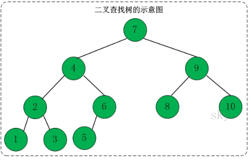

##二叉查找树(Binary Search Tree)，又被称为二叉搜索树。                
###Introduction
它是特殊的二叉树：对于二叉树，假设x为二叉树中的任意一个结点，x节点包含关键字key，节点x的key值记为key[x]。如果y是x的左子树中的一个结点，则key[y] <= key[x]；               
如果y是x的右子树的一个结点，则key[y] >= key[x]。那么，这棵树就是二叉查找树。如下图所示：                                           
           
        
在二叉查找树中：                 
- 若任意节点的左子树不空，则左子树上所有结点的值均小于它的根结点的值；           
- 任意节点的右子树不空，则右子树上所有结点的值均大于它的根结点的值；           
- 任意节点的左、右子树也分别为二叉查找树。             
- 没有键值相等的节点（no duplicate nodes）              
           
###Searching           
####1.递归版本的代码
```
private BSTNode<T> search(BSTNode<T> x, T key) {
    if (x==null)
        return x;

    int cmp = key.compareTo(x.key);
    if (cmp < 0)
        return search(x.left, key);
    else if (cmp > 0)
        return search(x.right, key);
    else
        return x;
}
```            
        
####2.非递归版本的代码         
```
private BSTNode<T> iterativeSearch(BSTNode<T> x, T key) {
    while (x!=null) {
        int cmp = key.compareTo(x.key);

        if (cmp < 0) 
            x = x.left;
        else if (cmp > 0) 
            x = x.right;
        else
            return x;
    }

    return x;
}
```         
         
###Maximum & Minimum           
```
private BSTNode<T> maximum(BSTNode<T> tree) {
    if (tree == null)
        return null;

    while(tree.right != null)
        tree = tree.right;
    return tree;
}

private BSTNode<T> minimum(BSTNode<T> tree) {
    if (tree == null)
        return null;

    while(tree.left != null)
        tree = tree.left;
    return tree;
}
```
            
