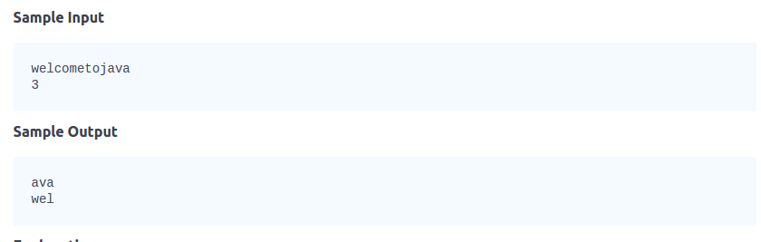
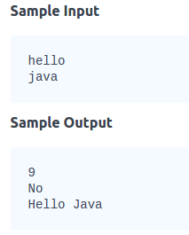
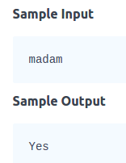
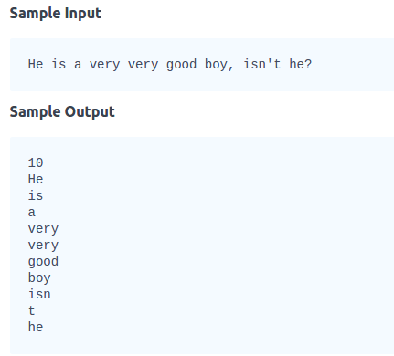

##String        
      
###1.Given a string, find out the lexicographically smallest and largest substring of length.
                
           
      
```
import java.io.*;
import java.util.*;
import java.text.*;
import java.math.*;
import java.util.regex.*;

public class Solution {

    public static void main(String[] args) {
        /* Enter your code here. Read input from STDIN. Print output to STDOUT. Your class should be named Solution. */
        Scanner reader = new Scanner(System.in);
        String s = reader.next();
        int k = reader.nextInt();
        System.out.println(minS(s,k));
        System.out.println(maxS(s,k));
    }
   public static String minS(String s,int k){
        String tmp = s.substring(0,k);
        for(int i = 0;i<=s.length()-k;i++){
            if(s.substring(i,i+k).compareTo(tmp)<0)
                tmp =  s.substring(i,i+k);
        }
        return tmp;
    }
    
    public static String maxS(String s,int k){
        String tmp = s.substring(0,k);
        for(int i = 0;i<=s.length()-k;i++){
            if(s.substring(i,i+k).compareTo(tmp)>0)
                tmp =  s.substring(i,i+k);
        }
        return tmp;
    }
}
```     
    
###2.Three String tasks
   
1. Sum the lengths of  and .         
2. Determine if  is lexicographically larger than  (i.e.: does  come before  in the dictionary?).       
3. Capitalize the first letter in  and  and print them on a single line, separated by a space.               
                        
                                    
                     
```
import java.io.*;
import java.util.*;

public class Solution {

    public static void main(String[] args) {
        
        Scanner sc=new Scanner(System.in);
        String A=sc.next();
        String B=sc.next();
        /* Enter your code here. Print output to STDOUT. */
        System.out.println(A.length()+B.length());
        System.out.println(A.compareTo(B)>0?"Yes":"No");
        System.out.println(A.substring(0,1).toUpperCase()+A.substring(1)+" "+B.substring(0,1).toUpperCase()+B.substring(1));
        
    }
}

```            
         
                
###3.Given a string , print Yes if it is a palindrome, print No otherwise.                
            
           
```
import java.io.*;
import java.util.*;

public class Solution {

    public static void main(String[] args) {
        
        Scanner sc=new Scanner(System.in);
        String A=sc.next();
        /* Enter your code here. Print output to STDOUT. */
        System.out.println(isP(A)==true?"Yes":"No");
    }
    
    public static boolean isP(String s){
        if(s.length()==0){
            return false;
        }
        if(s.length()==1)
            return true;
        for(int i = 0;i<=(s.length()-1)/2;i++){
            if(s.charAt(i)!=s.charAt(s.length()-1-i))
                return false;
        }
        return true;
    }
}

```        
                
           
###4.Two strings  and  are called anagrams if they consist same characters, but may be in different orders.         
**两个字符串,是否字母一样,顺序不一样,不在意大小写**                                             
                                    
```
static boolean isAnagram(String a, String b) {
        
        // Complete the function by writing your code here.
	if(a.length()!=a.length())
	return false;
	if(a.length()==0||b.length()==0||a==null||b==null)
	return false;
       char[]arr_a =  a.toLowerCase().toCharArray();
       char[]arr_b =  b.toLowerCase().toCharArray();
        Arrays.sort(arr_a);
        Arrays.sort(arr_b);
        for(int i = 0;i<a.length();i++){
            if(arr_a[i]!=arr_b[i])
                return false;
        }
        return true;
    }
```        
             
###5.String split using specific char                 
Given a string, matching the regular expression [A-Za-z !,?._'@]+, split the string into tokens. We define a token to be one or more consecutive English alphabetic letters. Then, print the number of tokens, followed by each token on a new line.                         
                                
          
```
import java.io.*;
import java.util.*;

public class Solution {

    public static void main(String[] args) {
        Scanner scan = new Scanner(System.in);
        String s = scan.nextLine();
        // Write your code here.
        String ss[] = s.split("[^a-zA-Z]");
        int count = 0;
        for(int i = 0;i<ss.length;i++){
        	if(ss[i].length()==0)
        		count++;
        }
        System.out.println(ss.length-count);
        for(int i = 0;i<ss.length;i++){
        	if(ss[i].length()!=0)
        	System.out.println(ss[i]);
        }
        scan.close();
    }
}

```           
                           

                     


