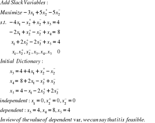

#Linear Programming Assignment 1
##                  Keyu Chen
           
**P1**            
                  
          
**P2**            
             
          
        
**P3**          
The matlab code is below:       
```
price =[2.563;4.307;6.422;3.488;6.581;8.993;11.481;11.730;
9.270;10.160;1.961; 9.300;11.672;10.877;12.137];%Unit Price
profit = [1.451;2.683;5.898;2.102;5.709;4.519;7.176;6.075;
5.718;7.442;1.234;4.680; 7.229;9.589;6.497];%unit Profit
risk = [1;2;3;1;2;4;3;2;2;1;3;4;1;2;3];%% 1234 means abcd
market = [1;2;2;3;2;2;2;1;3;4;1;4;3;4;2];%%1234 means different area
eco = [1;1;1;2;2;1;1;1;1;1;1;2;1;2;2];%% 1 means Eco Friendly

totalMoney = 10000;
riskA = zeros(15,1);%%Initial riskA   1
riskB = zeros(15,1);%%Initial riskB   2
riskC = zeros(15,1);%%Initial riskC   3
riskD = zeros(15,1);%%Initial riskD   4
marketTech = zeros(15,1);%%Tech   1
marketFinance = zeros(15,1);%%Finance   2
marketPetro = zeros(15,1);%%Petro   3
marketAuto = zeros(15,1);%%Automobile  4
ecoFriendly = zeros(15,1);%%eco friendly  1
ecoNot = zeros(15,1);%%eco not friendly  2
%%%%%%%%risk set%%%%%%%%%%%
riskA(find(risk==1))=1;
riskB(find(risk==2))=1;
riskC(find(risk==3))=1;
riskD(find(risk==4))=1;
%%%%%%%%market set%%%%%%%%%%%
marketTech(find(market==1))=1;
marketFinance(find(market==2))=1;
marketPetro(find(market==3))=1;
marketAuto(find(market==4))=1;
%%%%%%%%eco set%%%%%%%%%%%
ecoFriendly(find(eco==1))=1;
ecoNot(find(eco==2))=1;
%%%%%%%%Object Function%%%%%%%
objFunc = profit;
%%%%%%%%subject to Function%%%%%%%%%
sub1 = [price'];
sub2 = [riskA';-riskA';riskB';-riskB';riskC';-riskC';riskD';-riskD'];
sub3 = [marketTech';marketFinance';marketPetro';marketAuto'];
sub4 = [eco';-eco'];
subMain = [sub1;sub2;sub3;sub4];
%%%%%%%%values on the right of the subject function%%%%%%%%%%%%%%
values = [10000;3500;-1500;6500;-4500;3000;-1000;2500;-500;3000;4000;
5000; 7000;10000;-2000];%%%%%%%constrains%%%%%%%%%%%%
constrain = zeros(15,1);
%%%%%%%solution: linprog%%%%%%%%% x = linprog(f,A,b,Aeq,beq,lb,ub,x0)
x=linprog(-objFunc,subMain,values,[],[],constrain) 
profitMost = profit'*x

```             
          
The problem is feasible, and it is bounded.          
The optimal solution is as follows:             
         
      
      
**P4**            
P4(A)                 
               
   
P4(B)          
                 
        
   
**P5**  
P5(A)                         
The matlab code is below:           
```
price = [0.5;2.5;0.25;0.2;0.6];%% foods price.(cookie,ramen,rice,broccoli,cornflakes)
calories = [300;550;450;25;300];%% claories
carbs = [20;25;25;4;15];%% Carbs
protein = [5;8;4;2;3];%% protein
fats = [10;20;5;0.5;0.5];%% Fats
sodium = [0.1;0.9;0.1;0.1;0.1];%% Sodium

%%%%%%%%%subj function on the left%%%%%%%%
MainSub = [calories';-calories';carbs';-carbs';protein';-protein';
fats';-fats';sodium';sodium'];

%%%%%%%%%values on the right%%%%%%%%
values = [2200;-1800;100;-50;80;-30;100;-60;5;-3];

%%%%%%%%%Obj function%%%%%%%%%
objFunc = price;

%%%%%%%%%constrain%%%%%%%%%%%%%
constrain = zeros(5,1);

%%%%%%%%linprog%%%%%%%%%x=linprog(f,A,b,Aeq,beq,lb,ub)
x =linprog(objFunc,MainSub,values,[],[],constrain)

moneyMin = price'*x 
```           
The tool I use is matlab        
      
     
P5(B)         
         
 
         
           
          
